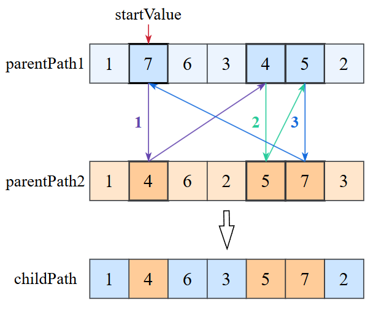

# Implementation of a genetic algorithm (GA)

2023

This repository contains an implementation of a genetic algorithm (GA) to solve the classical Traveling Salesman Problem (TSP).

## Problem Overview
### Traveling Salesman Problem (TSP)

The TSP is a combinatorial optimisation problem where a salesman needs to visit a set of cities exactly once and return to the starting city. The objective is to find the shortest possible route that allows the salesman to achieve this.

### Genetic Algorithm (GA)

To solve the TSP using a genetic algorithm, the following representations:

- Gene: A city.
- Chromosome: A path represented as a sequence of cities.
- Generation: A set of generated paths.

Algorithm Structure:

1. Initial Population: The algorithm begins by generating an initial population of maximum size.
2. Selection: Half of the best-performing chromosomes (paths with the shortest distances) are selected for reproduction. This mimics natural selection, where poorly adapted individuals are eliminated.
3. Crossover: Selected pairs of chromosomes are combined using cyclic single-point crossover to produce new offspring. This generates a new population of maximum size. The cyclic crossover operation is illustrated in Figure 1.
4. Mutation: A small percentage of chromosomes in the new generation undergo mutation to introduce variability.
5. Iteration: The process is repeated for several generations, with the best chromosomes from each generation contributing to the creation of the next.

Fig. 1

## Project Setup

1. Prerequisites

Before starting, make sure you have the following installed:

- IntelliJ IDEA (Community or Ultimate Edition)
- Java Development Kit (JDK), preferably JDK 8 or higher
- (Optional) Git, if you plan to clone the repository from a remote source

2. Importing the Project

Open IntelliJ IDEA: Launch IntelliJ IDEA on your computer.

Clone the Repository:

- Open a terminal and run the following command to clone the repository:

`git clone https://github.com/nemyrovskaa/GeneticAlgorythm_AI.git`

OR

Use IntelliJ's built-in Git integration:

- Go to File > New > Project from Version Control.
- Enter the repository URL and choose a destination folder.
- If you already have the project folder, go to File > Open in IntelliJ IDEA. Navigate to the folder containing the project and click OK.

3. Building and Running the Project

- Find the file containing the main method named Main.java.
- Right-click the file with the main method.
- Select Run 'Main'.
- IntelliJ will compile the project and execute the main method.
- The output will be displayed in the Run window at the bottom of the IDE.